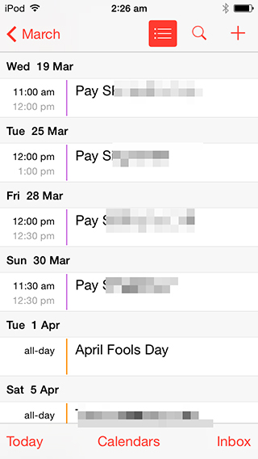

# Mobile Base requirement
 
## Program List

### Wireframe
[https://popapp.in/w/projects/5696be00171e40032f0b329b/mockups/5696be10d4590ff476c586e9](https://popapp.in/w/projects/5696be00171e40032f0b329b/mockups/5696be10d4590ff476c586e9)

### Description

List all the available Programs
 
## Program List Detail

### Wireframe
[https://popapp.in/w/projects/5696be00171e40032f0b329b/mockups/5696be16b10aa1f72eb47918](https://popapp.in/w/projects/5696be00171e40032f0b329b/mockups/5696be16b10aa1f72eb47918)

### Description

1. **Detail:** description of this program
2. **Book trail class:** User can book a trail class of this program.  

   * It should be setted in admin, if a program set to trail true, then this button show, otherwise do need to show this button. For example, **Summer Camp** don't have Book trail
3. **Sample Art Works**: Don't need to implement this version. Show it, but cannot click
4. **Photo List**: 
 
## Book Trail

### Wireframe
[https://popapp.in/w/projects/5696be00171e40032f0b329b/mockups/5696be17f1de3a7b2cd488f0](https://popapp.in/w/projects/5696be00171e40032f0b329b/mockups/5696be17f1de3a7b2cd488f0)

### Description
1. As discuss with Lan, For this version we can show the avaiable classes in a list. This is an example:

  

2. Just show the next 2 week avaialbe classes
3. Avaiable Classes condition
  
  * Class is not full. Default.
  * Class trail's max value not reach. Defualt value is 0

  How to calculate:
  
  `Class's current students number + Register trail student number<= Class's Max student + Class's trail Max student number` Then this day is available
  
  ***Note***
  
  * Case 1
  
       **Painting Beginning Class** max student number is 10, max trail student number is 0, currently registered student number is 9. 
       
       Now Mark book a trail for this class.
       
       After several day later, Kevin book this class, so after Kevin registered, this class's currently registered student number is 10, it should not be booked trail class, but Mark booked trail class before.
       
       For this conflict, need to solve by school manually.
